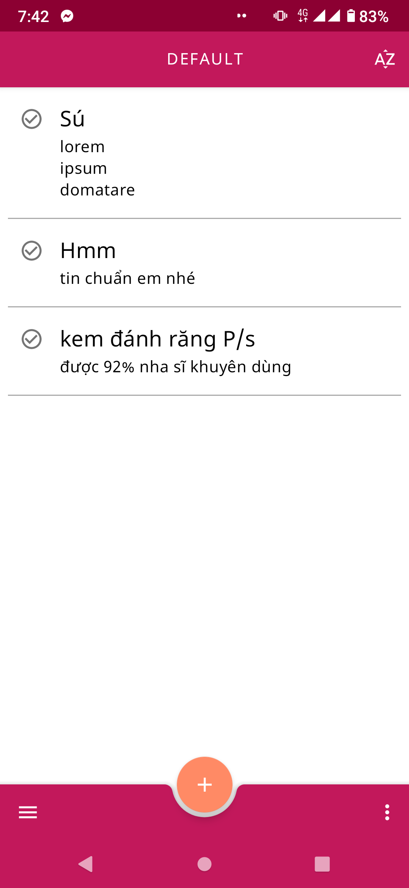
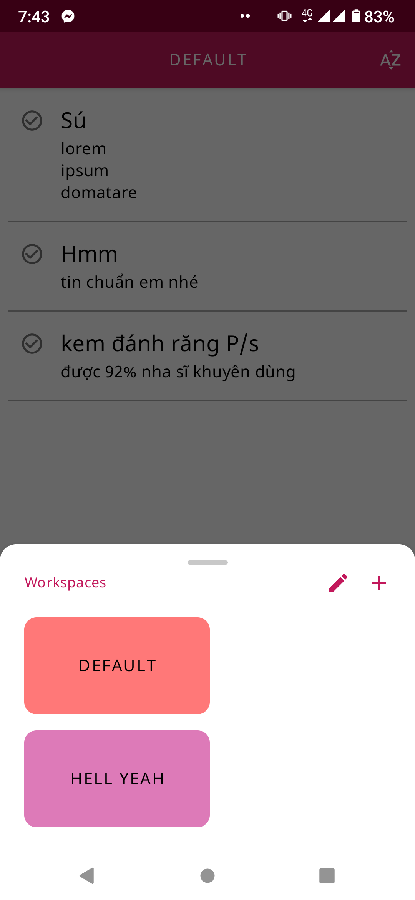
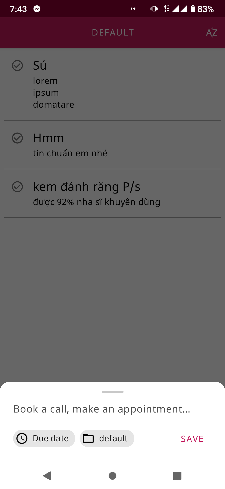
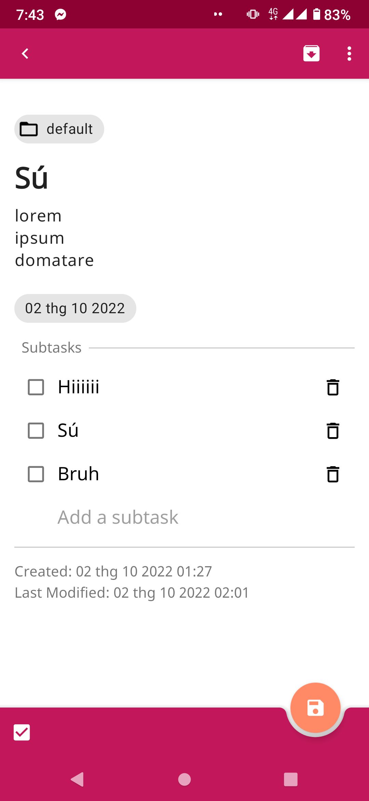
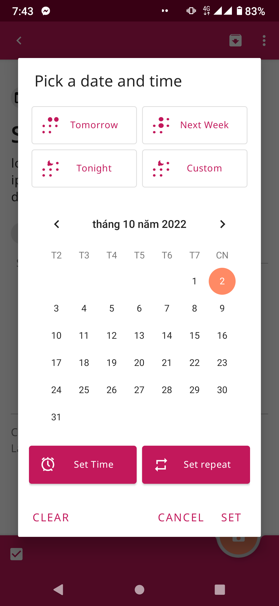

# Todo
- Mô tả: Đồ án cuối khoá Android cơ bản - ProPTIT

## Hình ảnh
<table>
  <tr>
    <td></td>
    <td></td>
    <td></td>
   </tr> 
   <tr>
      <td></td>
      <td></td>
      <td></td>
  </tr>
</table>

## Công nghệ sử dụng
### Room Database w/ Coroutine
- Sử dụng một số tính năng nâng cao: nhiều bảng, quan hệ 1-n, n-n.
- Database chưa tối ưu: DAO và Repo các hàm vẫn viết tràn lan, chưa clean code.
- Sử dụng kèm Repository Pattern. IO Database sử dụng Coroutine trong ViewModelScope và không sử
  dụng LiveData trong DAO.

### MVVM - LiveData - ViewBinding

- Chia ViewModel dựa theo Model Class. App có sử dụng SharedViewModel
- LiveData chủ yếu để update trong ViewModel, observed từ ngoài View.
- ViewBinding: chưa làm chủ được dataBinding nên dùng ViewBinding 😄

## Project Managing

- https://trello.com/b/8s5h70di/todo-app

## Tính năng

- Lưu nhắc nhở 3 cấp: Workspace(Group) / Task / Subtask
- Xem các nhắc nhở đã lưu trữ
- Lưu thời hạn deadline
- Sắp xếp theo thời gian thêm, thời gian chỉnh sửa gần nhất, deadline gần nhất

## Các tính năng dự tính chưa làm được

- Filter
- Tags cho task (đã có hàm logic chưa kịp làm UI)
- Notification

## Nhật ký

- Tuần 1:
    + Tham khảo các app Todo đã có sẵn, kết quả như
      sau: [Link](https://inudev-my.sharepoint.com/:x:/g/personal/inusedname_inudev_onmicrosoft_com/ETY_UwvEe0xLp1rWyx4BaNEBj7z2wcf8LNVREMpFTkWU0Q?e=pD6fQn)
      https://inudev-my.sharepoint.com/:x:/g/personal/inusedname_inudev_onmicrosoft_com/ETY_UwvEe0xLp1rWyx4BaNEBj7z2wcf8LNVREMpFTkWU0Q?e=pD6fQn
    + Bao gồm: Tính năng, thiết kế, độ mượt mà, dễ sử dụng, tính năng này có cần thiết không.
    + Quyết định làm theo khuôn mẫu của Google Keep, GG Task, Simple Todo

- Tuần 2:
    - Dựng Database cơ bản: gồm 3 cấp: Workspace, Task và Subtask (không nghiên cứu kỹ thiết kế CSDL
      nên sau phải sửa lại rất nhiều 😢)
    - Vẽ các layout ở mức cơ bản, tuy nhiên sau còn sửa nhiều (lí do: chưa có prototype, nghĩ đến
      đâu làm đến đấy)

- Tuần 3:
    - Hoàn thiện layout và logic của một số fragment chính trong app: Dialog AddWorkspace, Dialog
      ChooseWorkspace, Dialog AddTask, Fragment All

- Tuần 4:
    - Tiếp tục hoàn thiện layout và logic của các fragment: Fragment Detail, Dialog ChooseColor,
      Dialog ChooseDateTime
    - Thêm các Menu Button lên AppBar (chưa implement xong)

- Tuần 5:
    - Hoàn thiện đầy đủ các tính năng cơ bản
    - Thêm các xử lý input
    - Cải thiện UI/UX: Căn chỉnh bố cục các thành phần, thêm các thành phần tăng trải nghiệm người
      dùng
